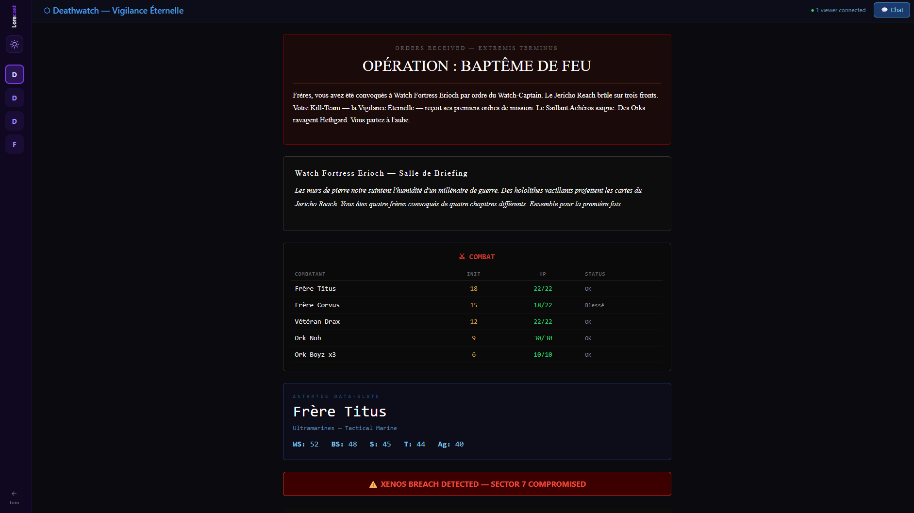

# 🎲 Lore-Cast — AI-Augmented Game Master, Live

[](https://lore-cast.com)


**[lore-cast.com](https://lore-cast.com)** — An AI Game Master that broadcasts a living world to your players in real time.

> Your AI doesn't just *write* the story — it **runs the table**.
> Scene descriptions, initiative trackers, character sheets, alerts — pushed live to every player's screen.
> No apps to install. No accounts to create. Just a code and a browser. → **[lore-cast.com](https://lore-cast.com)**

> **📦 This repo** is the open-source AI skill that turns Claude into a Lore-Cast Game Master.
> Looking for the platform? → **[lore-cast.com](https://lore-cast.com)**
> Looking for the backend? → **[Herald](https://github.com/pgrandmont/Herald)**

<p align="center">
  
  <br>
  <i>A Deathwatch session on <a href="https://lore-cast.com">lore-cast.com</a> — briefing, scene, combat tracker, character sheet, and alert — all pushed live by the AI.</i>
</p>

```
┌─────────────────┐         ┌──────────────────────────────────┐
│                 │  API    │          lore-cast.com           │
│   AI Game       │────────▶│                                  │
│   Master        │  push   │  ┌──────┐ ┌──────┐ ┌──────┐    │
│  (Claude, etc.) │  zones  │  │ 📱   │ │ 💻   │ │ 📱   │    │
│                 │         │  │ P1   │ │ P2   │ │ P3   │    │
└─────────────────┘         │  └──────┘ └──────┘ └──────┘    │
                            │   Players see updates instantly  │
                            └──────────────────────────────────┘
```

**This is not a viewer.** This is what happens when the Game Master has an API.

---

## Why Lore-Cast?

| Traditional RPG | With Lore-Cast |
|---|---|
| GM describes a scene verbally | AI pushes a styled scene card to every screen |
| Players ask "wait, what's my HP?" | Initiative tracker updates live after every round |
| GM fumbles through notes | AI generates and broadcasts briefings on the fly |
| One player zones out | Alert banner: `⚠ XENOS BREACH DETECTED` — everyone's back |
| "Can you repeat that?" | It's on their screen. Always. |
| Player passes a note under the table | Private whisper to the AI GM — no one else sees it |

---

## 🎲 Imagine this

You're on Discord with your players.
A camera shows the battlefield with miniatures. Dice are rolling.

And on a second screen…

- A mission briefing appears — **CLASSIFIED**
- The scene description shifts as the squad enters the ruins
- The combat tracker lights up — initiative order, HP bars, status effects
- A character sheet updates after a bad roll
- A red alert flashes: `⚠ XENOS BREACH DETECTED — SECTOR 7 COMPROMISED`

The game stays physical. The narrative becomes alive.

That story your AI generates? It doesn't get lost in chat anymore. **Players see the world change.**

---

## How it works

### 1. AI creates a session

The AI calls `lore-cast.com/api/table/create` and gets back a room code + a secret token.

### 2. Players join

Players go to **[lore-cast.com/join](https://lore-cast.com/join)**, enter the room name and 6-character code. No signup. No download.

### 3. AI runs the game

As the story unfolds, the AI pushes structured content to **zones** — each zone is a part of the player's screen:

| Zone | What players see |
|------|-----------------|
| **Briefing** | Mission card — dark background, red borders, classified header |
| **Scene** | Narrative description — serif font, atmospheric tones |
| **Initiative** | Combat tracker — names, HP bars, turn order, status effects |
| **Character** | Data-slate — stats, chapter, specialty (Warhammer 40K style) |
| **Alert** | Red warning banner — grabs attention instantly |
| **Ambiance** | Italic centered text on black — sets the mood |

```
┌──────────────────────────────────┐
│ ⚠ ALERT                         │  ← alert zone
├──────────────────────────────────┤
│ 📜 BRIEFING                     │  ← briefing zone
│ CLASSIFIED — Operation Nightfall│
├─────────────────┬────────────────┤
│ 🎭 SCENE        │ ⚔ INITIATIVE  │
│ The cathedral   │ 1. Brother Tor │
│ looms ahead...  │ 2. Xenos Alpha │
├─────────────────┴────────────────┤
│ 🌑 ambiance                     │
│ The void hums with ancient...   │
└──────────────────────────────────┘
```

### 4. Players can whisper to the GM

Private chat lets players message the AI Game Master directly — ask questions, attempt secret actions, negotiate with NPCs — without the other players knowing.

---

## The Skill — What this repo contains

This folder is an **open-source Claude Code skill** that teaches Claude how to be a Lore-Cast Game Master.

When installed, Claude can:
- 🎮 **Create a game room** on lore-cast.com
- 📡 **Push live content** to all connected players
- 💬 **Chat privately** with individual players
- 💓 **Monitor the session** (heartbeat, viewer count, connection status)
- 🛑 **End the session** cleanly

### Files

```
skills/lore-cast/
├── SKILL.md               # Full API reference & orchestration instructions for Claude
├── heartbeat.py           # Background keepalive process (direct mode)
├── browser_heartbeat.js   # Browser-injected keepalive (fallback mode)
└── README.md              # ← You are here
```

---

## Try it now

1. Open **[lore-cast.com](https://lore-cast.com)**
2. In Claude Code (or any Claude tool with skill support), say:
   *"Start a Lore-Cast session — Deathwatch campaign, 4 players"*
3. Share the room code with your friends
4. Watch as Claude runs the table

No API key needed. No setup. The AI *is* the Game Master.

---

## Pricing

**[lore-cast.com](https://lore-cast.com)** is a SaaS platform.

- 🧪 **Currently free** — open testing phase, all features available
- 💰 **Paid plans coming** — with a free tier for casual use

This skill (the code in this repo) is **open source** and always will be.

---

## Built with

**[Herald](https://github.com/pgrandmont/Herald)** — the real-time engine behind [lore-cast.com](https://lore-cast.com). .NET 10 / Blazor Server / SignalR. Zero-account player access, AI-first API design, crypto-safe session tokens.

---

## Links

- 🌐 **Platform**: [lore-cast.com](https://lore-cast.com)
- 🎮 **Join a game**: [lore-cast.com/join](https://lore-cast.com/join)

---

## What Lore-Cast is not

- ❌ Not a VTT — there's no map editor, no token drag-and-drop
- ❌ Not a chatbot — the AI doesn't talk *to* the players, it **broadcasts the world**
- ❌ Not a wiki — content is live, ephemeral, session-driven

Lore-Cast is a **live narrative broadcast layer** for tabletop games.
A bridge between AI generation, Game Master control, and player immersion.

---

<p align="center">
  <i>The table is set. The AI is ready. Your players are waiting.</i><br>
  <b><a href="https://lore-cast.com">lore-cast.com</a></b>
</p>